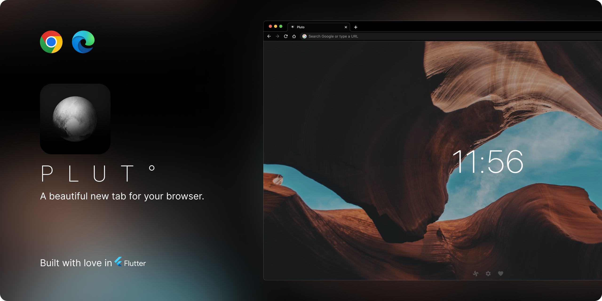

<p align="center"> </p>
<p align="center">  </p>
<p align="center">  </p>

<p align="center">A beautiful new tab for Chrome/Edge built with love ❤️ in <a href="https://flutter.dev/">Flutter</a>.</p>




See live demo [here](https://birjuvachhani.github.io/pluto/).

## Features:
- Select from wide range of background colors and gradients or use huge selection of curated background images from Unsplash.
- Create your own collection of photos you like by adding photos to favorites.
- Set grey-scale or background tint or toggle tint to your liking to make it feel right at home! 
- No analytics, no ads, no tracking. Pure privacy!
- Support local images (Coming soon!)

### Widgets:
1. **Digital/Analog Clock:** Keep track of time by having a clock always on you new tab customized to your liking.
2. **Message:** Write your favorite quotes or quick notes with Message widget.
3. **Timer:** Always keep tabs on your running timer with Timer widget that also allows you to customize the message along with it.
4. **Weather:** Keep an eye out on the surrounding weather with this minimal weather widget.

## Installation

### Install to Chrome/Edge

<a href="https://chrome.google.com/webstore/detail/pluto/cjhgdglialdlkabijejcpddhjjagdkio"></a>‎ ‎ ‎ ‎ 
<a href="https://microsoftedge.microsoft.com/addons/detail/pluto/fhldfedplhnmdpfkdmdopelpbhjkmken"></a>

#### Local Install

1. Download `pluto.zip` from [Releases](https://github.com/birjuvachhani/pluto/releases)
2. Unzip the file
3. In Chrome/Edge go to the extensions page (`chrome://extensions` or `edge://extensions`).
4. Enable Developer Mode.
5. Drag the unzipped folder anywhere on the page to import it (do not delete the folder afterwards).

## Build from source

1. Clone the repo
2. Install dependencies with `flutter pub get`
3. Run `flutter build web --release --web-renderer html --csp`
4. Load the `build/web` directory to your browser

## Credits

This project is inspired by [avinayak/minim](https://github.com/avinayak/minim)

```
MIT License

Copyright © 2022 Birju Vachhani

Permission is hereby granted, free of charge, to any person obtaining a copy
of this software and associated documentation files (the "Software"), to deal
in the Software without restriction, including without limitation the rights
to use, copy, modify, merge, publish, distribute, sublicense, and/or sell
copies of the Software, and to permit persons to whom the Software is
furnished to do so, subject to the following conditions:

The above copyright notice and this permission notice shall be included in all
copies or substantial portions of the Software.

THE SOFTWARE IS PROVIDED "AS IS", WITHOUT WARRANTY OF ANY KIND, EXPRESS OR
IMPLIED, INCLUDING BUT NOT LIMITED TO THE WARRANTIES OF MERCHANTABILITY,
FITNESS FOR A PARTICULAR PURPOSE AND NONINFRINGEMENT. IN NO EVENT SHALL THE
AUTHORS OR COPYRIGHT HOLDERS BE LIABLE FOR ANY CLAIM, DAMAGES OR OTHER
LIABILITY, WHETHER IN AN ACTION OF CONTRACT, TORT OR OTHERWISE, ARISING FROM,
OUT OF OR IN CONNECTION WITH THE SOFTWARE OR THE USE OR OTHER DEALINGS IN THE
SOFTWARE.
```
